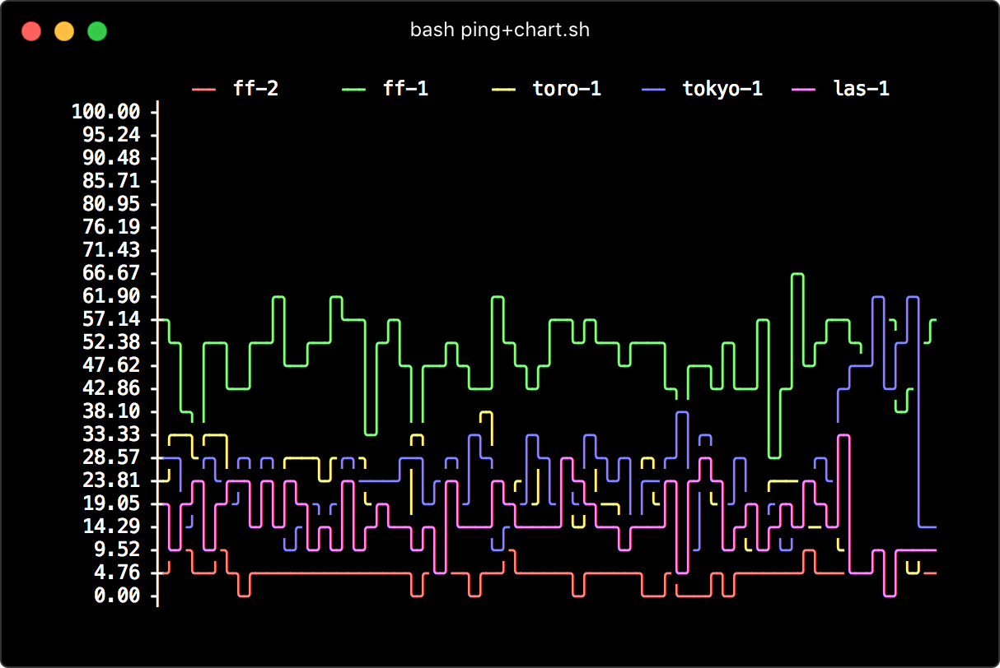
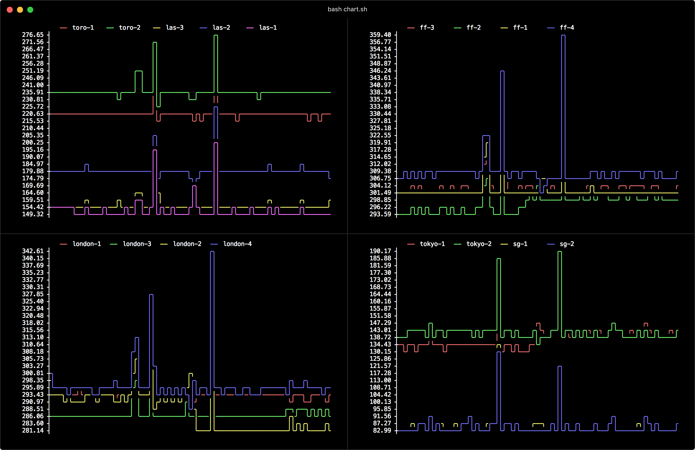

# ping+chart

Ping statistics in ASCII chart.

</img>

## Basic Usage

Create `servers.lst` like:

    192.168.1.1
    1.234.56.78
    8.8.8.8
    1.2.3.4

Plot realtime ping chart of packet loss statistics (the default metric):

    bash ping+chart.sh

Available metrics:

- **sent** - packets sent
- **receive** - packets received
- **loss (default)** - % packet loss
- **avg** - average RTT value in millisecond
- **min** - minumum RTT value
- **max** - maximum RTT value
- **stddev** - standard deviation on RTT

E.g, plot average network latency statistics:

    bash chart+ping.sh avg

_**NOTE** It can take seconds to generate a single chart._

## chart.sh

The `chart.sh` is a bash implementation of ASCII chart inspired by
[asciichart](https://github.com/kroitor/asciichart) with additional features:

- Multiple data series
- Color scheme (built-in dark/light theme and 256 color support)
- Non-continuous data series support
- Legend box (can be turn off by `NO_LEGEND=1` flag)

## Advanced Usage

### Multiple Chart Display

Collect ping statistics in separate process:

    bash ping.sh | tee ping.log

Plot chart continously:

    bash ping+chart.sh -f ping.log [other chart options]

### Snapshot

Export chart script:

    bash ping+chart.sh -q -r > loss-chart.cs

Plot chart from snapshot:

    bash chart.sh < loss-chart.cs

## Todos

- [x] better performance
- [ ] Y-axis auto down scale (too slow)
- [x] chart legend display
- [x] tweak color scheme

## License

(The MIT License)
